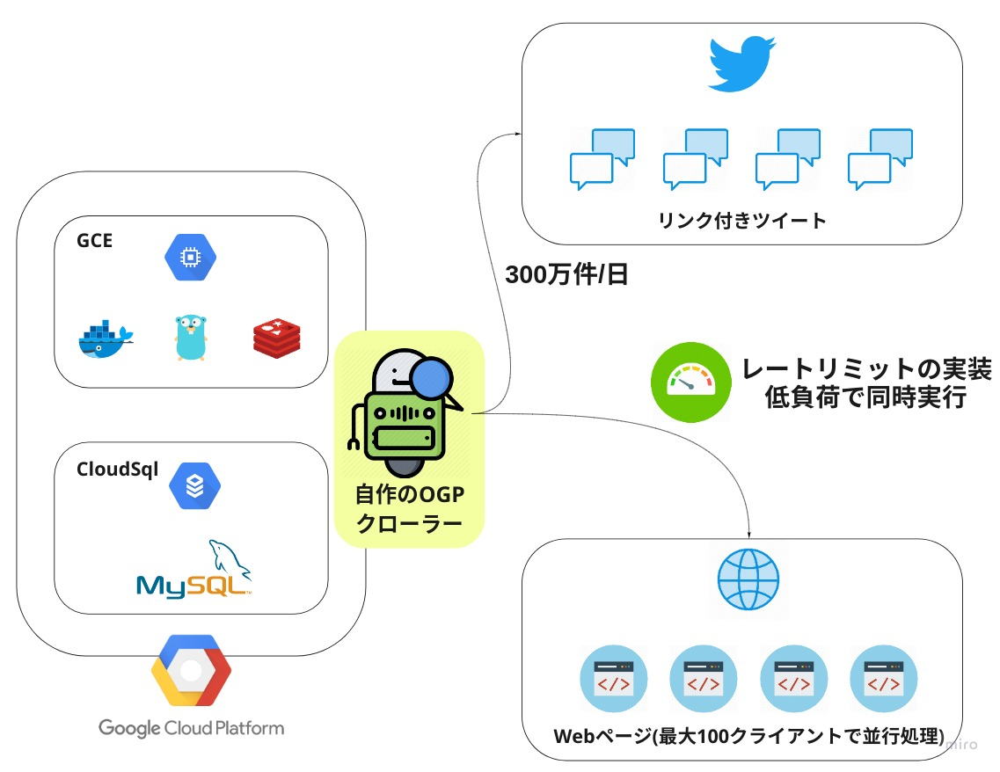

<h1 align="center">OGP Crawler</h1>

## ハイライト
### :star2: クローリングを並行実行  

### :alarm_clock: レートリミットを実装  

### :page_with_curl: Yaml形式の設定ファイル  

### :tv: Mackerelによるシステム監視  

### :computer: プリペアドステートメントによる安全&高速なクエリ  
